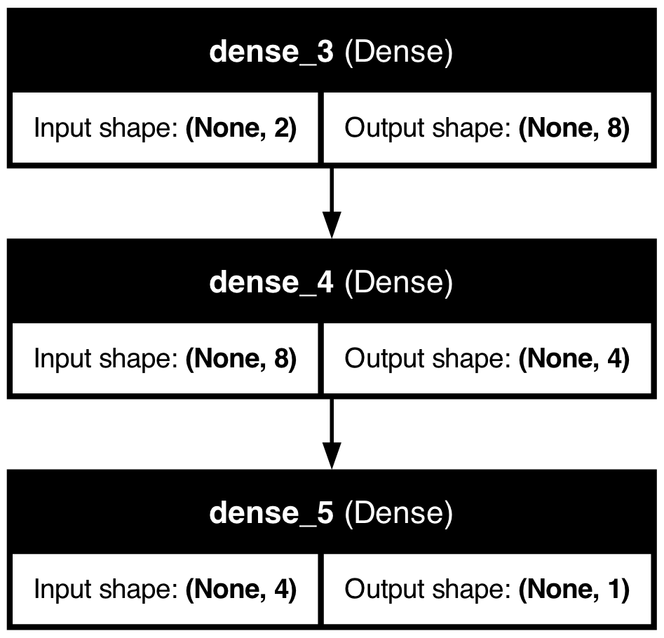

# Deep Learning Models
This repository contains three deep learning models - Simple Artificial Neural Network, Convolutional Neural Network, and Recurrent Neural Network implemented on different use cases.

<h1>Simple Neural Network</h1>

This model was used for a simple binary classification problem with two features. The features were standardized using <code>StandardScaler</code> before being split and sent into the neural network for training. The figure below visualizes the architecture chosen for the neural network.

  

The model was compiled using the Adam optimizer, binary crossentropy as the loss function, and accuracy as the evaluation metric. Training was conducted over 200 epochs with a batch size of 50.

The training and validation loss and accuracy were plotted. The figure is shown below:

  

The loss and accuracy of the neural network are <b>0.494</b> and <b>0.843</b>, respectively.

A confusion matrix was also plotted to assess the model's performance. See below:

  

